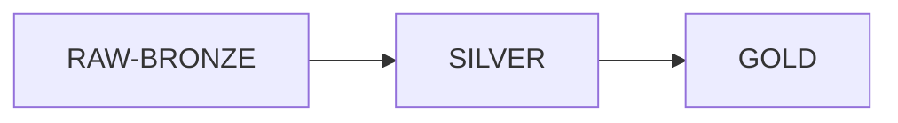

# RETAIL-SALES - DATABRICKS
Este proyecto tiene como objetivo la ingesta y procesamiento de datos de ventas mensuales de un comercio retail, con el fin de habilitar su explotación en herramientas de Business Intelligence (BI) y modelos de Machine Learning (ML).

El equipo de ventas carga los datos en formato CSV en un directorio específico el primer día de cada mes. Cada ingesta corresponde a la información del mes inmediatamente anterior.

## Requisitos

Se requieren las siguientes estructuras de datos:
-   Una tabla con datos agregados de clientes
-   Una tabla con datos agregados de ventas

Estas tablas serán utilizadas por:
-   El equipo de analistas, para la creación de dashboards que apoyen la toma de decisiones del negocio
-   El equipo de Data Science, para el desarrollo de modelos de predicción de ventas y segmentación de clientes, con el objetivo de optimizar campañas de marketing

## Solución 

### Medallion Architecture
Para cumplir con los requisitos, se ha diseñado una arquitectura basada en la arquitectura **Medallion**, compuesta por las siguientes capas:
-   **Bronze**: almacenamiento de los datos en bruto (raw) tal como se ingieren desde los archivos CSV
-   **Silver**: limpieza, validación y transformación de los datos
-   **Gold**: generación de tablas agregadas de clientes y ventas listas para su consumo en BI y ML

### Orquestación

Para la ingesta y procesamiento de los datos se ha configurado un **Job de Databricks** con las siguientes características:
-   **🕒 Trigger**: ejecución programada el primer día de cada mes
    -   Expresión en formato Cron: `0 0 1 * *`
-   **🔄 Dependencias entre notebooks**:  los notebooks se ejecutan de forma secuencial siguiendo el flujo del pipeline:

- **🚨 Alertas**:  se ha configurado una notificación por correo electrónico en caso de fallo durante la ejecución del job.

## Organización del proyecto

En Databricks se ha creado una carpeta de git vinculada a un repositorio de github en la que se almacena la siguiente información:
- 📁 Data: contiene los archivos de datos en formato CSV utilizados en el proceso de ingesta
	- 📁INPUT: directorio donde el equipo de ventas deposita mensualmente los archivos CSV con los datos de ventas
	- 📁HISTORICAL: contiene los archivos CSV que ya han sido procesados
	- 📁PENDING: almacena los archivos CSV que aún no han sido procesados
	
- 📁Pipelines: Incluye los notebooks encargados del procesamiento de datos siguiendo la arquitectura Medallion
	- 🔄RAW-BRONZE: notebook encargado de la ingesta de datos desde el directorio INPUT hacia la capa Bronze
	- 🔄SILVER: notebook responsable de la limpieza, validación y transformación de los datos provenientes de Bronze
	- 🔄GOLD: notebook que realiza las agregaciones necesarias sobre los datos de Silver y los carga en las tablas finales
	
- 📁Tables: Directorio donde se almacenan las definiciones de las tablas todas las capas.

- 📄SCHEMA: Script encargado de la creación del catálogo y de los esquemas necesarios para el proyecto.

